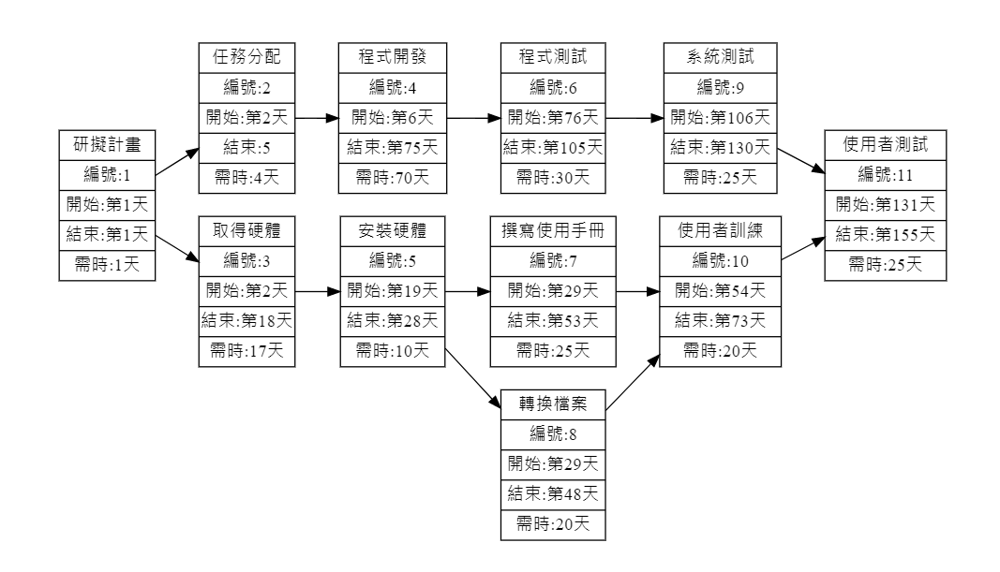
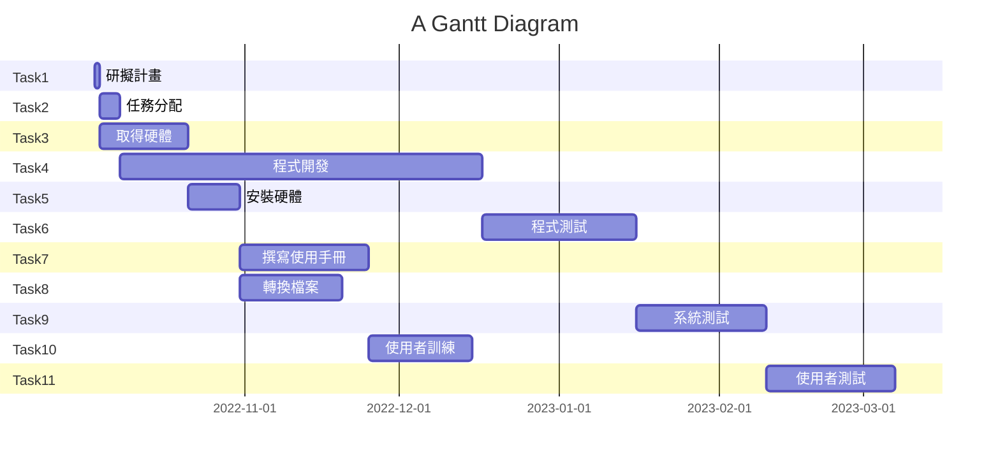

# PERT/CPM 圖

### 關鍵路徑：1 > 2 > 4 > 6 > 9 > 11
---
# 甘特圖

```mermaid
gantt
title A Gantt Diagram
dateFormat  YYYY-MM-DD

     section Task1
研擬計畫           :t1, 2022-10-03, 1d
     section Task2
任務分配           :t2, after t1, 4d
     section Task3
取得硬體           :t3, after t1, 17d
     section Task4
程式開發           :t4,after t2, 70d
     section Task5
安裝硬體           :t5, after t3, 10d
     section Task6
程式測試           :t6, after t4, 30d
     section Task7
撰寫使用手冊  :t7, after t5, 25d
     section Task8
轉換檔案           :t8, after t5, 20d
     section Task9
系統測試           :t9, after t6, 25d
     section Task10
使用者訓練       :t10, after t7, 20d
     section Task11
使用者測試       :t11, after t9, 25d
    
```
